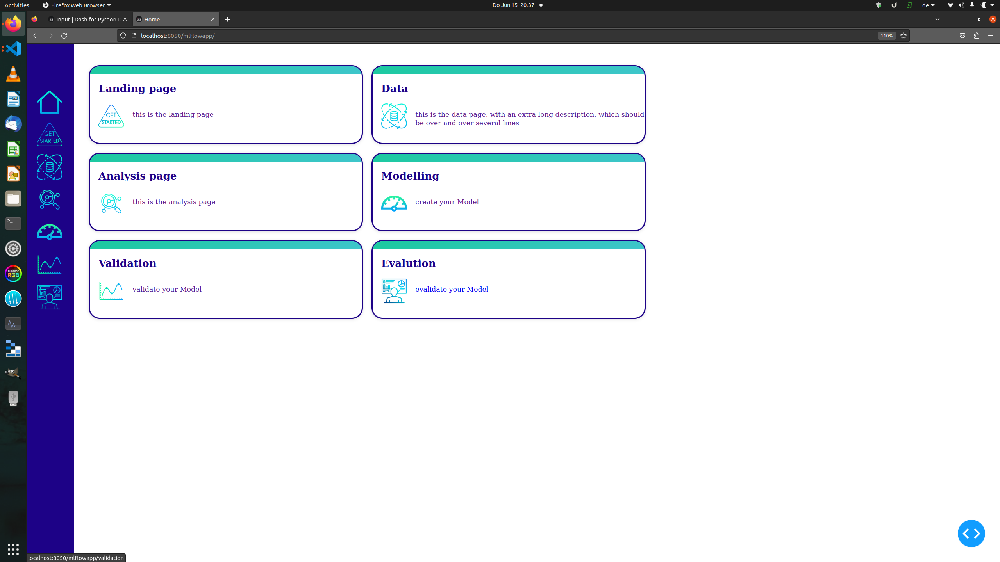
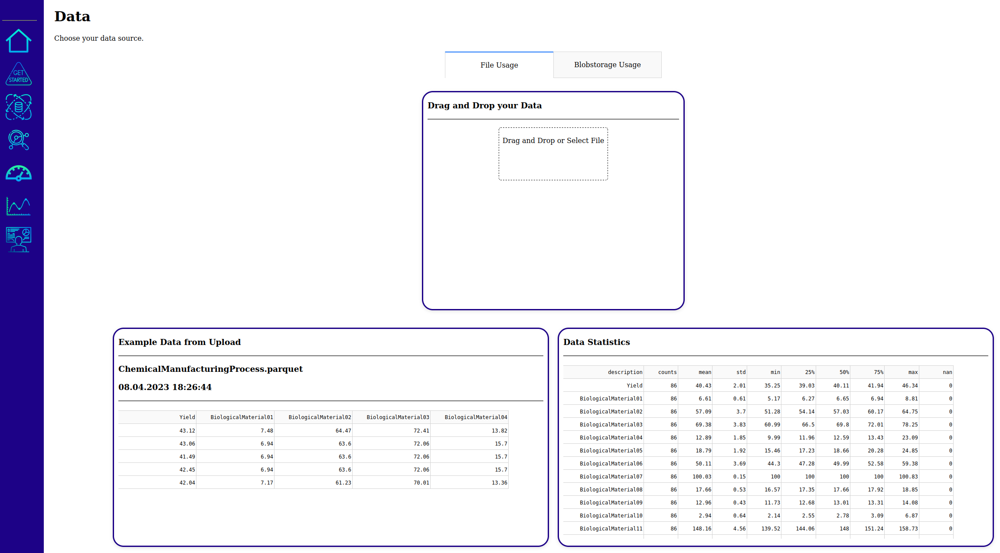
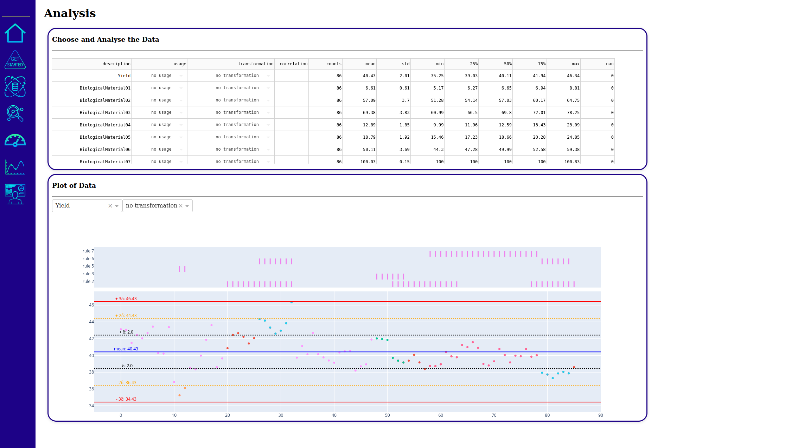
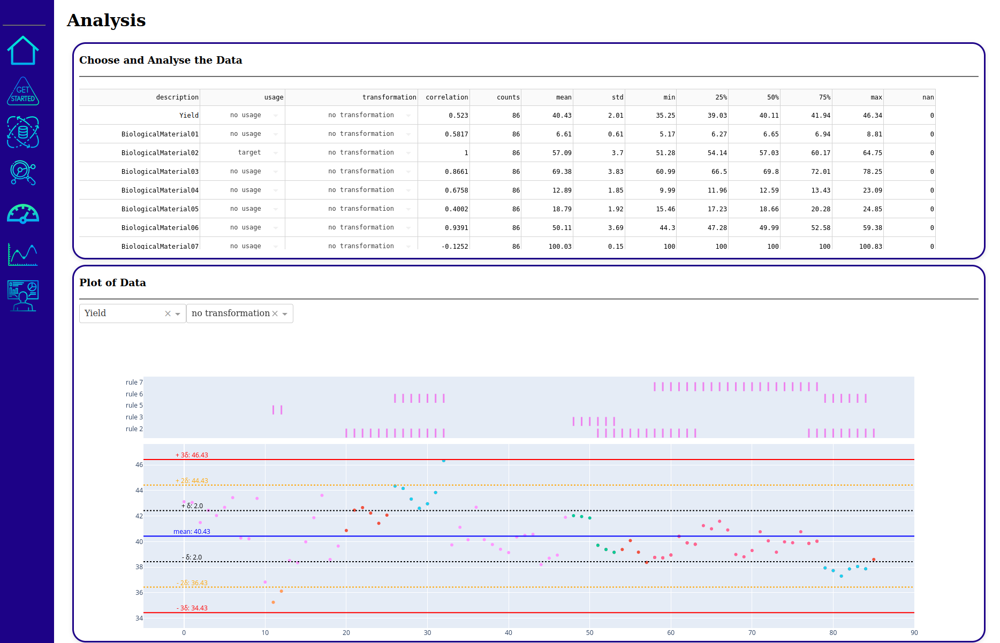
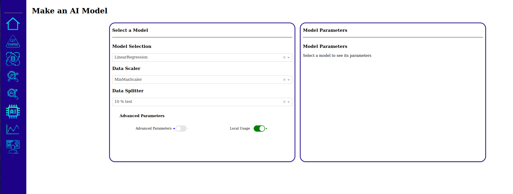

# mlflow_workflow_app

- link: http://localhost:8050/mlflowapp/landing


# Icons

- free icons: https://www.flaticon.com/de/


## Landing



## Data



## Data Preprocessing

### No target selected



### Target selected




### Modeling




It will be neccessary to push your model to this docker compose system. 

## Linux

```

export AZURE_STORAGE_CONNECTION_STRING="DefaultEndpointsProtocol=http;AccountName=devstoreaccount1;AccountKey=Eby8vdM02xNOcqFlqUwJPLlmEtlCDXJ1OUzFT50uSRZ6IFsuFq2UVErCz4I6tq/K1SZFPTOtr/KBHBeksoGMGw==;BlobEndpoint=http://localhost:10000/devstoreaccount1;QueueEndpoint=http://localhost:10001/devstoreaccount1"

export MLFLOW_TRACKING_URI="http://localhost:5000"

```

## Windows
```
set AZURE_STORAGE_CONNECTION_STRING="DefaultEndpointsProtocol=http;AccountName=devstoreaccount1;AccountKey=Eby8vdM02xNOcqFlqUwJPLlmEtlCDXJ1OUzFT50uSRZ6IFsuFq2UVErCz4I6tq/K1SZFPTOtr/KBHBeksoGMGw==;BlobEndpoint=http://localhost:10000/devstoreaccount1;QueueEndpoint=http://localhost:10001/devstoreaccount1"


set MLFLOW_TRACKING_URI=http://localhost:5000

```


Azure Blob Storage is optimized for storing massive amounts of unstructured data. Unstructured data is data that doesn't adhere to a particular data model or definition, such as text or binary data. Blob storage offers three types of resources:

    The storage account
    A container in the storage account
    A blob in the container

The following diagram shows the relationship between these resources:

Diagram of Blob storage architecture


Use the following Python classes to interact with these resources:

    BlobServiceClient: The BlobServiceClient class allows you to manipulate Azure Storage resources and blob containers.
    ContainerClient: The ContainerClient class allows you to manipulate Azure Storage containers and their blobs.
    BlobClient: The BlobClient class allows you to manipulate Azure Storage blobs.


https://learn.microsoft.com/en-us/azure/storage/blobs/storage-quickstart-blobs-python?tabs=managed-identity%2Croles-azure-portal%2Csign-in-azure-cli


